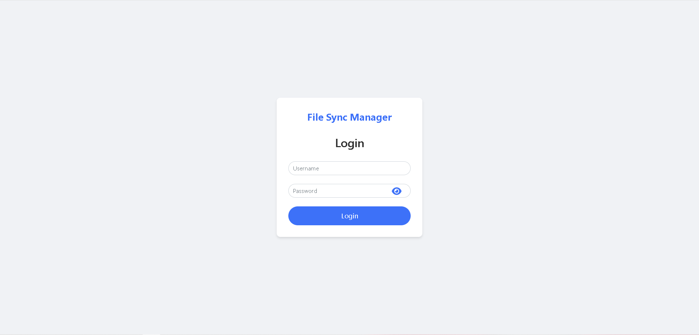
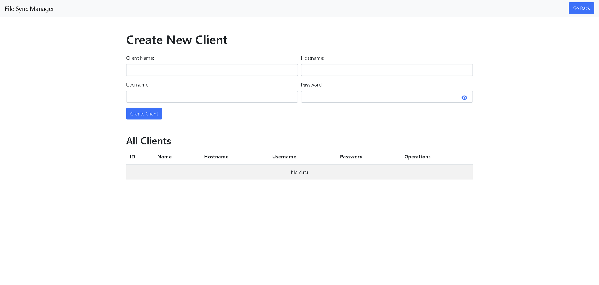
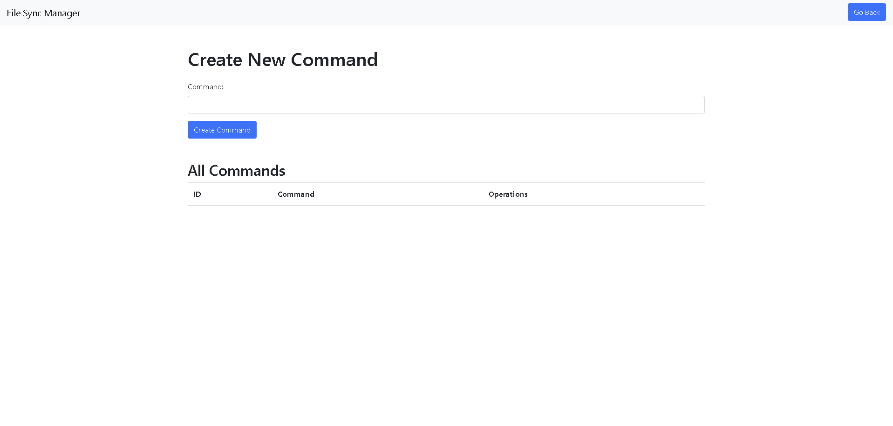

# 🔁 File Sync & Remote Execution Tool

A custom-built FastAPI-based platform to simplify and automate bulk file transfers and remote command execution across multiple Linux client devices — developed to replace unreliable third-party tools and manual SSH workflows.

---

## 🚀 Why This Project Was Built

Manually transferring files and executing commands on 20–30 Linux clients was:
- Time-consuming ❌  
- Prone to failure ❌  
- Not scalable ❌  

So I proposed and developed this **internal automation tool** to streamline our process:
- Upload once, sync to many clients
- Run post-transfer `sudo` commands automatically
- Track real-time progress via WebSocket
- All operations run fully asynchronously with FastAPI & Paramiko

---

## 🛠 Features

✅ Add and manage client devices (hostnames, credentials)  
✅ Create file sync requests: source → destination  
✅ Attach `sudo` commands to run post-transfer  
✅ Track progress & status of all sync jobs  
✅ Retry failed jobs, update tasks  
✅ Modern login UI, clean backend  

---

## ⚙️ Tech Stack

- **Backend:** FastAPI, SQLAlchemy, Paramiko  
- **Database:** MySQL  
- **Frontend:** Jinja2 + Bootstrap (templates)  
- **Async Engine:** `asyncio`, background tasks  
- **WebSocket:** Real-time sync progress monitoring  
- **Security:** Admin login via `config.ini`, password-protected

---

## 📂 Project Structure

```
.
├── main.py              # FastAPI app entrypoint
├── config.ini           # DB and admin credentials
├── requirements.txt     # Dependencies
├── static/              # CSS, JS, assets
├── templates/           # Login, dashboard pages
└── README.md
```

---

## 🧪 How to Run (Development)

> Requirements: Python 3.10+, MySQL

1. Clone the repo and install dependencies:
```bash
pip install -r requirements.txt
```

2. Set up your MySQL DB and update `config.ini`:
```ini
[database]
user = youruser
password = yourpassword
host = localhost
port = 3306
database = sync_master

[web_admin]
username = youradmin
password = yourpassword
```

3. Run the app:
```bash
python main.py
```

4. Visit: [http://localhost:9000](http://localhost:9000)

---

## 📸 Screenshots

### 🔐 Login Page


---

### 🏠 Home Dashboard


---

### 🧾 Client Creation Form


---

### 🛠 Command Management Form


---

## 📈 What's Next

- Token-based user management (multi-user support)  
- File diffing for smart sync  
- Deployment with Docker + Nginx  
- CI/CD setup  
